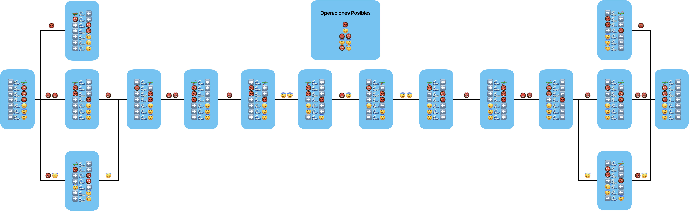

# Taller: Acertijo de los Misioneros y los Caníbales

**Estudiante:** Gabriel Andres Anzola Tachak

En el acertijo de los misioneros y los caníbales: tres misioneros y tres caníbales tienen que cruzar un río con una barca que solo puede llevar como máximo dos personas. Si existen misioneros presente en tierra, no puede pueden estar con un mayor número de caníbales, porque los caníbales se comerían a los misioneros. La barca no puede cruzar por el río sin personas a bordo.

Desarrollar una representación de estados para este acertijo, definir las acciones que se pueden realizar, construir el grafo de espacio de soluciones, definir la prueba de objetivo de un estado y encontrar la solución (camino en el grafo), mediante alguna de las búsquedas vistas en clase.

Bono\*: Adicional a la definitiva 2%. Desarrollar un agente inteligente que juegue este acertijo en la siguiente página: https://www.novelgames.com/es/missionaries/
El agente debe procesar la pantalla, determinar el estado en el que se encuentra el juego, planear las acciones a ejecutar y luego simular el teclado para solucionar el problema. Podría empezar en una situación como la de la imagen:

## Representación de estados

### Estado inicial

➡️🌊🛶 
➡️🌊👹 
➡️🌊👹 
➡️🌊👹 
➡️🌊😇 
➡️🌊😇 
➡️🌊😇

### Operaciones posibles

- 👹 Mover un caníbal
- 😇 Mover un misionero
- 👹😇 Mover dos caníbales
- 😇😇 Mover dos misioneros
- 👹😇 Mover un caníbal y un misionero

Cada movimiento tiene requisito de que la barca esté del lado donde haya personas para mover. Además, en tierra, no puede haber más caníbales que misioneros.

### Grafo de estados

