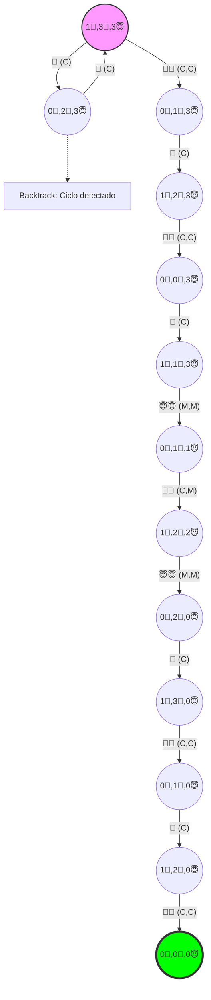

# Taller: Acertijo de los Misioneros y los Caníbales

**Estudiante:** Gabriel Andres Anzola Tachak

En el acertijo de los misioneros y los caníbales: tres misioneros y tres caníbales tienen que cruzar un río con una barca que solo puede llevar como máximo dos personas. Si existen misioneros presente en tierra, no puede pueden estar con un mayor número de caníbales, porque los caníbales se comerían a los misioneros. La barca no puede cruzar por el río sin personas a bordo.

Desarrollar una representación de estados para este acertijo, definir las acciones que se pueden realizar, construir el grafo de espacio de soluciones, definir la prueba de objetivo de un estado y encontrar la solución (camino en el grafo), mediante alguna de las búsquedas vistas en clase.

Bono\*: Adicional a la definitiva 2%. Desarrollar un agente inteligente que juegue este acertijo en la siguiente página: https://www.novelgames.com/es/missionaries/
El agente debe procesar la pantalla, determinar el estado en el que se encuentra el juego, planear las acciones a ejecutar y luego simular el teclado para solucionar el problema. Podría empezar en una situación como la de la imagen:

## Representación de estados

Podemos representar la situacion de dos formas, una visual y una representación mediante una tupla matemática $(B,C,M)$ donde:

- $B$ es la posición de la barca (1 si está en la orilla inicial, 0 si está en la orilla final)
- $C$ es el número de caníbales en la orilla inicial
- $M$ es el número de misioneros en la orilla inicial

### Estado inicial

➡️🌊🛶 
➡️🌊👹 
➡️🌊👹 
➡️🌊👹 
➡️🌊😇 
➡️🌊😇 
➡️🌊😇

Representado por la tupla $(1,3,3)$

### Estado objetivo

🛶🌊⬅️ 
👹🌊⬅️ 
👹🌊⬅️ 
👹🌊⬅️ 
😇🌊⬅️ 
😇🌊⬅️ 
😇🌊⬅️

Representado por la tupla $(0,0,0)$

### Operaciones posibles

- 👹 Mover un caníbal $(C)$
- 😇 Mover un misionero $(M)$
- 👹👹 Mover dos caníbales $(C,C)$
- 😇😇 Mover dos misioneros $(M,M)$
- 👹😇 Mover un caníbal y un misionero $(C,M)$

**Restricción:** Cada movimiento tiene requisito de que la barca esté del lado donde haya personas para mover. Además, en tierra, no puede haber más caníbales que misioneros.

### Prueba de Objetivo

La prueba de objetivo consiste en verificar si el estado actual del sistema coincide exactamente con la configuración de éxito: $(0,0,0)$. Si el buscador llega a este estado, la tarea se considera finalizada.

### Algoritmo de Búsqueda: Búsqueda en Profundidad (DFS)

Para recorrer el grafo y encontrar la solución, se utiliza la Búsqueda en Profundidad (Depth-First Search).

- **Lógica:** El algoritmo expande siempre el nodo más profundo de la frontera actual.
- **Funcionamiento:** Utiliza una estructura de pila o cola **LIFO** (Last-In, First-Out). El algoritmo toma el estado inicial, genera un sucesor y "se sumerge" por esa rama hasta el final antes de intentar con otra opción.
- **Aplicación en el Grafo:** Si el DFS elige una rama que lleva a un estado inválido (donde los caníbales se comen a los misioneros), el algoritmo realiza un retroceso (backtracking) para intentar por el siguiente camino disponible hasta encontrar la ruta que llega al objetivo $(0,0,0)$

### Grafo de estados posibles

Este grafo muestra visualmente todas las combinaciones posibles de misioneros y caníbales en ambas orillas, incluyendo las combinaciones que aunque válidas, son descartadas por el algoritmo de búsqueda en profundidad.

### Grafo Solución

Este grafo muestra la solución al acertijo de los misioneros y los caníbales, es decir, el camino que debe seguir el algoritmo de búsqueda en profundidad para llegar al objetivo $(0,0,0)$.

### Solución Encontrada (Camino)

Siguiendo la exploración de DFS, el camino que resuelve el acertijo es:

$$(1🛶,3👹,3😇) \xrightarrow{CC} (0🛶,1👹,3😇) \xrightarrow{C} (1🛶,2👹,3😇) \xrightarrow{CC} (0🛶,0👹,3😇) \xrightarrow{C} (1🛶,1👹,3😇) \xrightarrow{MM} (0🛶,1👹,1😇) \xrightarrow{CM} (1🛶,2👹,2😇) \xrightarrow{MM} (0🛶,2👹,0😇) \xrightarrow{C} (1🛶,3👹,0😇) \xrightarrow{CC} (0🛶,1👹,0😇) \xrightarrow{C} (1🛶,2👹,0😇) \xrightarrow{CC} (0🛶,0👹,0😇)$$

### Link al repositorio del proyecto

Intento de solución del acertijo de los misioneros y los caníbales mediante un agente inteligente que utiliza Playwright para interactuar con el juego en línea.

[https://github.com/gabotachak/misioneros-canibales](https://github.com/gabotachak/misioneros-canibales)