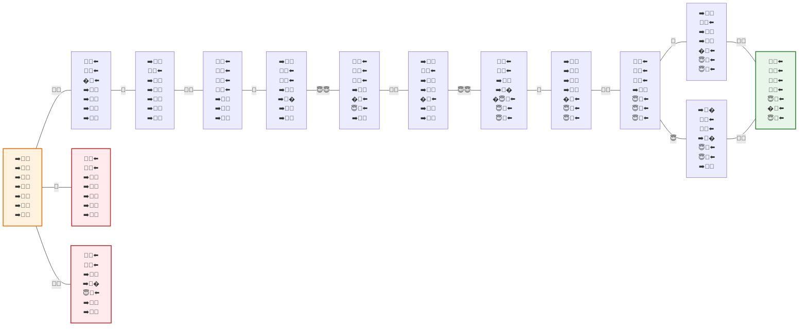

# Grafo de Estados del Acertijo

Este diagrama en `mermaid` representa el espacio de búsqueda del problema partiendo desde el estado inicial con todas las entidades en la orilla derecha, y navegando a través de las transiciones (los movimientos de caníbales 👹 y misioneros 😇) hasta cruzar a todos a la orilla izquierda.

