# Grafo de Estados del Acertijo

Este diagrama en `mermaid` representa el espacio de búsqueda del problema partiendo desde el estado inicial con todas las entidades en la orilla derecha, y navegando a través de las transiciones (los movimientos de caníbales 👹 y misioneros 😇) hasta cruzar a todos a la orilla izquierda.

```mermaid
graph LR
    %% Definir los estados con el formato visual de líneas:
    N0["➡️🌊🛶<br>➡️🌊👹<br>➡️🌊👹<br>➡️🌊👹<br>➡️🌊😇<br>➡️🌊😇<br>➡️🌊😇"]
    N1["🛶🌊⬅️<br>👹🌊⬅️<br>�🌊⬅️<br>➡️🌊👹<br>➡️🌊😇<br>➡️🌊😇<br>➡️🌊😇"]
    N2["➡️🌊🛶<br>👹🌊⬅️<br>➡️🌊👹<br>➡️🌊👹<br>➡️🌊😇<br>➡️🌊😇<br>➡️🌊😇"]
    N3["🛶🌊⬅️<br>👹🌊⬅️<br>👹🌊⬅️<br>👹🌊⬅️<br>➡️🌊😇<br>➡️🌊😇<br>➡️🌊😇"]
    N4["➡️🌊🛶<br>👹🌊⬅️<br>👹🌊⬅️<br>➡️🌊👹<br>➡️🌊�<br>➡️🌊😇<br>➡️🌊😇"]
    N5["🛶🌊⬅️<br>👹🌊⬅️<br>👹🌊⬅️<br>➡️🌊👹<br>�🌊⬅️<br>😇🌊⬅️<br>➡️🌊😇"]
    N6["➡️🌊🛶<br>👹🌊⬅️<br>➡️🌊👹<br>➡️🌊👹<br>�🌊⬅️<br>➡️🌊😇<br>➡️🌊😇"]
    N7["🛶🌊⬅️<br>👹🌊⬅️<br>➡️🌊👹<br>➡️🌊�<br>�😇🌊⬅️<br>😇🌊⬅️<br>😇🌊⬅️"]
    N8["➡️🌊🛶<br>➡️🌊👹<br>➡️🌊👹<br>➡️🌊👹<br>�🌊⬅️<br>😇🌊⬅️<br>😇🌊⬅️"]
    N9["🛶🌊⬅️<br>👹🌊⬅️<br>👹🌊⬅️<br>➡️🌊👹<br>😇🌊⬅️<br>😇🌊⬅️<br>😇🌊⬅️"]
    N10["➡️🌊🛶<br>👹🌊⬅️<br>➡️🌊👹<br>➡️🌊👹<br>�🌊⬅️<br>😇🌊⬅️<br>😇🌊⬅️"]
    Alt10["➡️🌊�<br>👹🌊⬅️<br>👹🌊⬅️<br>➡️🌊�<br>😇🌊⬅️<br>😇🌊⬅️<br>➡️🌊😇"]
    Goal["🛶🌊⬅️<br>👹🌊⬅️<br>👹🌊⬅️<br>👹🌊⬅️<br>😇🌊⬅️<br>�🌊⬅️<br>😇🌊⬅️"]
    
    %% Nudos sin salida (Nodos muertos/explorados)
    TL["🛶🌊⬅️<br>👹🌊⬅️<br>➡️🌊👹<br>➡️🌊👹<br>➡️🌊😇<br>➡️🌊😇<br>➡️🌊😇"]
    BL["🛶🌊⬅️<br>👹🌊⬅️<br>➡️🌊👹<br>➡️🌊�<br>😇🌊⬅️<br>➡️🌊😇<br>➡️🌊😇"]

    %% Transiciones del camino exitoso (horizontal principal)
    N0 -- "👹👹" --- N1
    N1 -- "👹" --- N2
    N2 -- "👹👹" --- N3
    N3 -- "👹" --- N4
    N4 -- "😇😇" --- N5
    N5 -- "👹😇" --- N6
    N6 -- "😇😇" --- N7
    N7 -- "👹" --- N8
    N8 -- "👹👹" --- N9
    N9 -- "👹" --- N10
    N10 -- "👹👹" --- Goal

    %% Ramificaciones iniciales (muertas)
    N0 -- "👹" --- TL
    N0 -- "👹😇" --- BL

    %% Bifurcación final encontrada
    N9 -- "😇" --- Alt10
    Alt10 -- "👹😇" --- Goal

    %% Estilos de los nodos
    style TL fill:#ffebee,stroke:#c62828,stroke-width:2px
    style BL fill:#ffebee,stroke:#c62828,stroke-width:2px
    style Goal fill:#e8f5e9,stroke:#2e7d32,stroke-width:2px
    style N0 fill:#fff3e0,stroke:#ef6c00,stroke-width:2px
```

